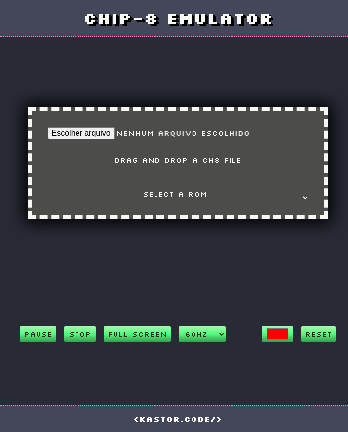

## CHIP-8 Emulator TypeScript

> 👷 Developed by Matheus Ramalho de Oliveira  
🔨 Brazilian Software Engineer  
🏡 Goiânia, Goiás, Brasil  
✉️ kastorcode@gmail.com  
👍 [instagram.com/kastorcode](https://instagram.com/kastorcode)

---

  

  This software runs programs written for the CHIP-8 computing architecture directly in the browser. This is the first emulator I program to improve my software engineering skills.

  Architected and programmed during the <a href="https://udemy.com/course/emulator" target="_blank">Build a Chip-8 Emulator in JavaScript that runs on a browser</a> course.

---

### Screenshots

  

  

---

### Controls

`|1|2|3|C|` = `|1|2|3|4|`  
`|4|5|6|D|` = `|Q|W|E|R|`  
`|7|8|9|E|` = `|A|S|D|F|`  
`|A|0|B|F|` = `|Z|X|C|V|`  

`ArrowLeft` | `Numpad4` = `scroll to canvas`  
`ArrowRight` | `Numpad6` = `pause and scroll to rom info`  
`Backspace` | `Escape` = `stop`  
`Enter` | `Space` = `toggle pause`  
`Numpad0` | `Numpad5` = `full screen`  

---

### Tools used
[Chip-8 Technical Reference](http://devernay.free.fr/hacks/chip8/C8TECH10.HTM)  
[Git](https://git-scm.com)  
[TypeScript](https://typescriptlang.org)  
[Visual Studio Code](https://code.visualstudio.com)  
[Webpack](https://webpack.js.org)

---

### Topics covered

1. Understanding what is Chip-8;
2. Creating our Chip-8 virtual microprocessor;
3. Creating our Display;
4. Creating the support code and live server;
5. Connecting the Display to the HTML and scaling up the resolution;
6. Creating our Memory;
7. Creating the Registers;
8. Creating the Keyboard;
9. Create our char set sprites from 0-F and load into memory;
10. Drawing sprites in the display;
11. Implement Delay Timer;
12. Implement Sound Timer;
13. Understanding binary files;
14. Creating our Disassembler and our first Chip-8 instruction CLR;
15. Creating our instruction set file;
16. Loading our first ROM into Chip-8 memory;
17. Understanding opcode, how Chip-8 stores data, Big Endian vs Little Endian;
18. Disassembling opcodes and sending for execution;
19. Implementing all 35 Chip-8 instructions.

---

### 8️⃣ Installation and execution

1. Make a clone of this repository;
2. Open the project folder in a terminal;
3. Run `yarn` to install dependencies;
4. Run `yarn build` to start Webpack module bundler;
5. Launch one live server to serve the app and open it in a browser.

---

  <big><b>&lt;kastor.code/&gt;</b></big>

